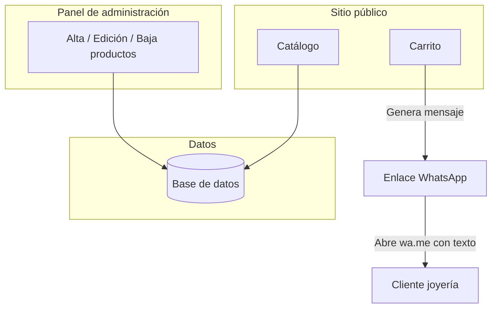

# Plan Dmur Joyería

**Documento de planificación técnica**  
Sitio catálogo con panel de administración y carrito de interés vía WhatsApp.

---

## 1. Objetivo del producto

- **Sitio público:** catálogo de productos de la joyería.
- **Panel de administración:** el cliente (dueño del negocio) puede crear, editar y eliminar productos.
- **Carrito de interés:** el visitante selecciona uno o varios productos y, en lugar de pagar en la web, se abre WhatsApp con un mensaje prearmado para que el cliente cierre la venta por ese canal. No se procesan pagos en la página.

---

## 2. Flujo principal



- El carrito no procesa pagos: solo construye un texto (lista de productos) y redirige a `https://wa.me/<número>?text=<mensaje>`.
- No se utiliza WhatsApp Business API; el número se obtiene de la base de datos (editable por el admin).

---

## 3. Stack tecnológico definido

| Área | Tecnología |
|------|------------|
| Frontend | React con TypeScript |
| Framework | Next.js (App Router) |
| Estilos | Tailwind CSS |
| Backend | Next.js (Route Handlers en el mismo proyecto) |
| Base de datos | Supabase (PostgreSQL, Auth, Storage) |
| Autenticación admin | Supabase Auth (email + contraseña) |
| Hosting | Vercel (recomendado) |

---

## 4. Modelo de datos (Supabase)

- **Tabla `products`:** `id`, `name`, `description`, `price` (opcional), `image_url` o varias URLs, `active`, `created_at`, `updated_at`.
- **Tabla `settings`:** configuración del negocio; al menos `whatsapp_number` (ej. `5491112345678`) para el enlace `wa.me`, editable desde el panel de administración.
- **Imágenes:** Supabase Storage para las fotos de productos.
- **Auth:** Supabase Auth para una cuenta de administrador (registro deshabilitado o restringido).

---

## 5. Estructura del proyecto

```
Dmur-Joyeria/
├── app/
│   ├── layout.tsx
│   ├── page.tsx
│   ├── producto/[id]/page.tsx
│   ├── carrito/page.tsx
│   ├── admin/
│   │   ├── layout.tsx
│   │   ├── page.tsx
│   │   ├── productos/nuevo/
│   │   ├── productos/[id]/editar/
│   │   └── configuracion/          (número WhatsApp)
│   └── api/
│       ├── products/
│       ├── products/[id]/
│       ├── settings/
│       └── auth/
├── components/
│   ├── catalog/
│   ├── cart/
│   └── admin/
├── lib/
│   ├── supabase.ts
│   ├── products.ts
│   ├── settings.ts
│   └── whatsapp.ts
├── types/
└── public/
```

---

## 6. Pasos de implementación

### Fase 1 — Setup

1. Crear proyecto Next.js con TypeScript y Tailwind CSS.
2. Crear proyecto en Supabase; configurar variables de entorno (URL, anon key, etc.).
3. Crear en Supabase las tablas `products` y `settings` (con al menos `whatsapp_number`).
4. Configurar Supabase Auth (email + contraseña) y deshabilitar registro público si aplica.
5. Crear cliente Supabase en `lib/supabase.ts` (servidor y navegador).

### Fase 2 — Catálogo público

1. Implementar Route Handlers o carga en servidor para listar productos desde Supabase.
2. Página principal (`app/page.tsx`) con grid/listado de productos usando Tailwind.
3. Opcional: página de detalle `app/producto/[id]/page.tsx`.
4. Mostrar imágenes desde Supabase Storage (URLs públicas o firmadas).

### Fase 3 — Carrito y WhatsApp

1. Estado del carrito en cliente (Context o Zustand), con persistencia opcional en `localStorage`.
2. Página `app/carrito/page.tsx` con resumen de productos seleccionados.
3. Endpoint o función que devuelva el número de WhatsApp desde `settings`.
4. En `lib/whatsapp.ts`: armar mensaje con la lista de productos y construir `https://wa.me/<número>?text=<mensaje_codificado>`.
5. Botón «Contactar por WhatsApp» que abra ese enlace en nueva pestaña o ventana.

### Fase 4 — Panel de administración

1. Rutas bajo `app/admin/` protegidas con Supabase Auth (middleware o comprobación de sesión en layout).
2. Página de login (Supabase Auth).
3. CRUD de productos: listado, alta, edición y baja; formularios con Tailwind.
4. Subida de imágenes a Supabase Storage y asociación al producto.
5. Pantalla o sección de configuración para editar el número de WhatsApp (lectura/escritura de `settings`).
6. API interna: `app/api/products/` (GET, POST), `app/api/products/[id]/` (GET, PUT, DELETE), `app/api/settings/` (GET, PUT), con validación de sesión admin.

### Fase 5 — Cierre y despliegue

1. Revisión de SEO básico (meta tags, títulos).
2. Favicon y ajustes de marca si aplica.
3. Despliegue en Vercel (conectar repositorio y configurar variables de entorno de Supabase).
4. Configurar dominio propio si se requiere.

---

## 7. Resumen de decisiones

- **Framework:** Next.js (front y backend en un solo proyecto).
- **Estilos:** Tailwind CSS en todo el proyecto.
- **Base de datos y auth:** Supabase (PostgreSQL, Auth, Storage).
- **Autenticación del panel:** Supabase Auth (email + contraseña).
- **Número de WhatsApp:** editable desde el panel; guardado en la tabla `settings`.
- **Hosting:** Vercel para la aplicación; Supabase para datos, auth e imágenes.
